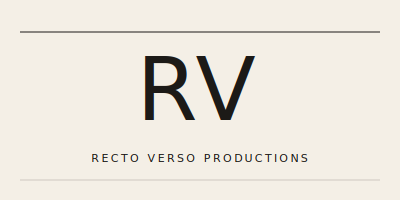
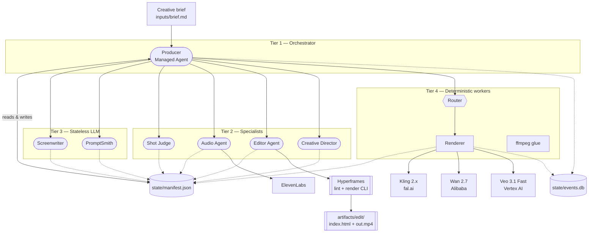

<p align="center">
  
</p>

# rectoverso

**A multi-agent AI filmmaking pipeline built for the "Built with Opus 4.7" Hackathon.**

`rectoverso` takes a creative brief and autonomously produces an assembled short film. It orchestrates shots, voiceovers, sound effects, and deterministically renders a final composition to MP4 using specialized agents coordinated by a primary orchestrator.



## Architecture (The Secret Sauce)

`rectoverso` employs a strict **Tiered Agent System** governed by the golden rule: **no agents talk to each other directly.** All coordination is managed by reading and writing to a shared JSON state machine (`state/manifest.json`), the single source of truth.

| Tier | Role | Implementation |
|---|---|---|
| **Tier 1** | **Producer Orchestrator** | Owns the manifest, manages the long-running session, and handles cross-shot quality control. |
| **Tier 2** | **Specialists** | Stateful agents that perform file operations and self-verify their work (e.g., `shot_judge`, `audio_agent`, `editor_agent`, `creative_director`). |
| **Tier 3** | **Generators** | Single-turn, stateless LLM calls via standard API (`screenwriter`, `prompt_smith`). |
| **Tier 4** | **Workers** | Deterministic non-LLM workers (API polling, video/audio renderers, `ffmpeg`). |

## Agent Contracts

Before any tool is dispatched, the Producer runs a suite of isolated validations (`src/contracts/`). These validation steps catch silent agent hallucinations and configuration drift (e.g., trying to invoke an editor before shots are approved). 
Contracts act as an un-bypassable verification layer that ensures pipeline integrity at every step.

## Provider Routing

The core IP includes an intelligent, dynamic video provider router based on the scene's complexity and available budget (`router/capabilities.yaml`):

- **Workhorses:** Free-quota metered models like **Alibaba Wan 2.7 Plus** and **Kling 2.x** process the bulk of the film.
- **Specialty:** Expensive, high-quality cinematic renders like **Vertex AI Veo 3.1 Fast** are reserved exclusively for critical "hero" shots within strict budget caps.

## Editor / Compositing

The final compositing is handled deterministically via **Hyperframes** (an HTML-based composition framework). The Editor Agent builds out an HTML timeline of approved shots and audio tracks, which is then compiled into a guaranteed frame-accurate `.mp4`.

## How to Run

To run the pipeline fully offline without draining any API credits, use Demo Mode. This will bypass the live APIs and orchestrator wait times by generating mock outputs from our verified "Golden Path" fixtures.

```bash
# 1. Install dependencies
python3 -m venv .venv
source .venv/bin/activate
pip install -r requirements.txt

# 2. Generate Demo Fixtures
./scripts/make_golden_demo.py

# 3. Export Demo Artifacts to Site
./scripts/export_site.py
```

After running `export_site.py`, all manifest state, events, and the final `.mp4` are dumped into `site/data/` and `site/media/`.

You can now serve the `site/` directory locally to see the final hackathon presentation output!

```bash
python3 -m http.server -d site 8080
```
Open `http://localhost:8080` in your browser.
