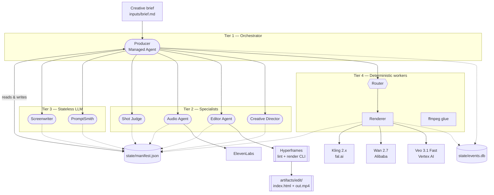
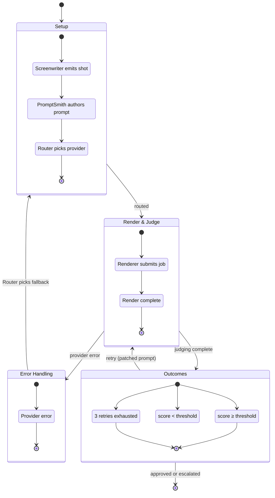
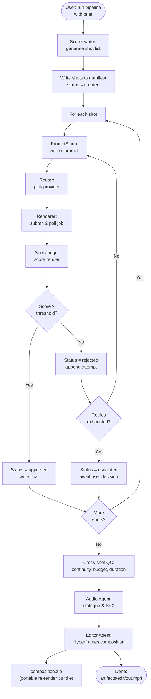
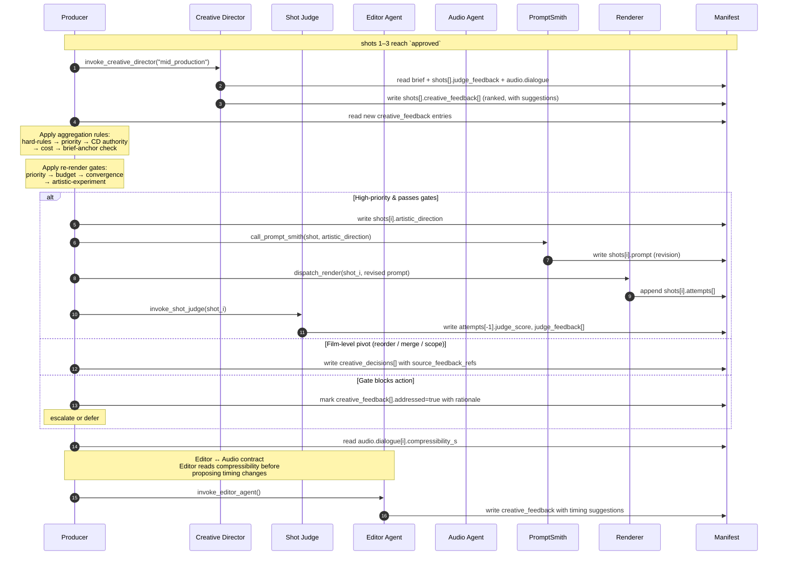
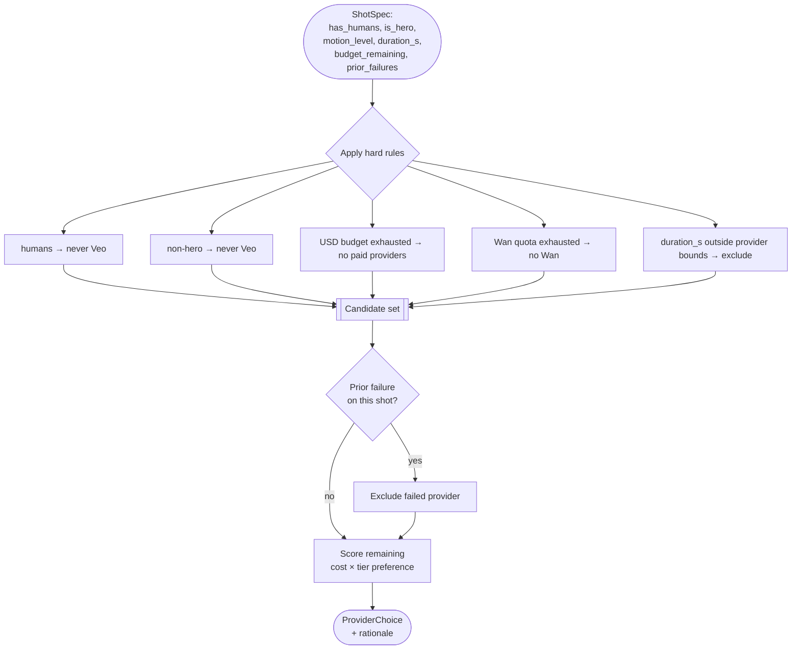
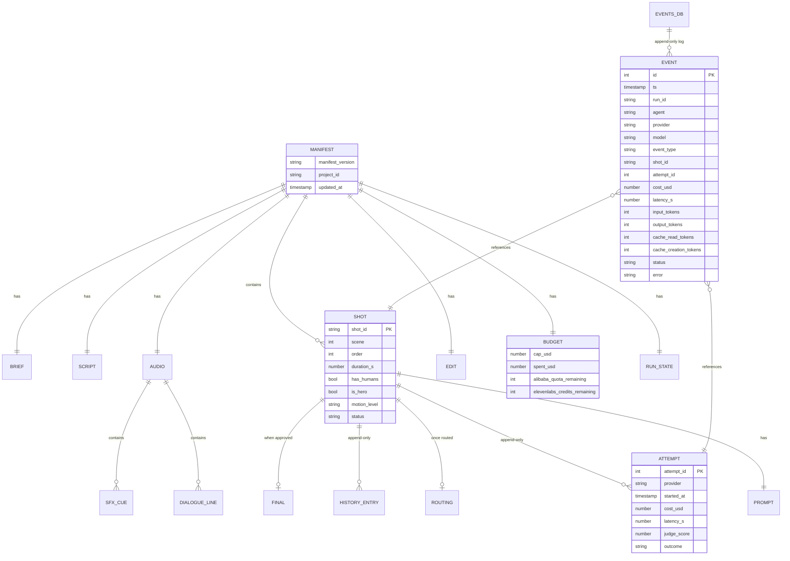

# Architecture

> **rectoverso** — a multi-agent AI filmmaking pipeline. Input: a creative brief. Output: an assembled short film. The pipeline is tiered, resumable, and budget-aware.

This document is the top-level technical overview. See also:
- [manifest-schema.md](manifest-schema.md) — the keystone data contract
- [agents.md](agents.md) — per-agent responsibilities and prompts
- [../CLAUDE.md](../CLAUDE.md) — build/compliance rules + deadlines
- [../router/capabilities.yaml](../router/capabilities.yaml) — provider matrix + hard rules

---

## 1. System overview



**Coordination rule:** agents never talk to each other directly. Every handoff goes through the manifest — read inputs, write outputs. Producer reads manifest state, invokes specialists, reconciles on restart.

---

## 2. Why tiered

Not everything is a Managed Agent. Tier is decided by whether work is long-running, stateful, and tool-using:

| Tier | Why it exists | Members |
|------|---------------|---------|
| 1 | Owns manifest, long session, cross-shot QC | `producer` |
| 2 | Multi-turn, file ops, self-verification loops | `shot_judge`, `audio_agent`, `editor_agent`, `creative_director` |
| 3 | Single-turn, no tools, no state | `screenwriter`, `prompt_smith` |
| 4 | Deterministic API polling and file I/O | `router`, `renderer`, `ffmpeg` |

If a capability is stateless generation, it does not become a Managed Agent to inflate the "managed agents used" count. The judging criterion rewards *thoughtful* application.

---

## 3. Shot lifecycle

Every shot moves through a status state machine. The manifest is resumable: on restart, Producer reads each shot's status and picks up where it left off.



Append-only invariants: `shot.attempts[]` and `shot.history[]` are never mutated — each retry is a new attempt, each status change is a new history entry. This is what makes SQLite (`events.db`) and the JSON manifest cross-verifiable; they should never disagree, and if they do, SQLite wins.

---

## 4. Producer orchestration

One shot's journey through the pipeline. Producer is the only caller; specialists respond and update the manifest.



Cross-shot reconciliation (continuity, duration, budget) happens in Producer after all shots reach `approved`. That's where the cross-shot QC Tier-1 earns its existence.

---

## 4a. Creative feedback loop

The pipeline is not only mechanical — specialists can challenge the film's shape through manifest-mediated creative feedback. The Producer is the only agent that acts on it; specialists themselves do not coordinate directly. See [agents.md § Agent pair contracts](agents.md#agent-pair-contracts) for the full field-level matrix.



The loop is bounded by hard caps in the Producer: max 3 `"mid_production"` Creative Director invocations per project, max 2 creative-driven re-renders per shot, and escalation on convergence failure (same feedback repeating after a prior address). These caps are load-bearing — without them the pipeline can ping-pong between Editor and Creative Director indefinitely.

A reference implementation of the decision rules lives at [tests/creative/resolver.py](../tests/creative/resolver.py); the runtime Producer's behavior must satisfy the same invariants exercised by [tests/creative/test_loop_scenarios.py](../tests/creative/test_loop_scenarios.py).

---

## 5. Router decision flow

The router is the core IP — it's what turns cost, capability, and compliance rules into a provider choice. Every hard rule from [router/capabilities.yaml](../router/capabilities.yaml) must have an isolated unit test in [tests/router/](../tests/router/).



Hard rules are non-negotiable gates, not scores. A shot with `has_humans=true` will **never** route to Veo, even if Veo is cheaper and everything else is exhausted — the router refuses and the Producer escalates.

---

## 6. Data model

Two stores, with different purposes and different write patterns.



**`state/manifest.json`** — single current-state document. Validated against [schemas/manifest.schema.json](../schemas/manifest.schema.json) before every write. Non-atomic operations flip `run_state.resumable=false` until consistent; on restart the Producer refuses new work until it reconciles.

**`state/events.db`** — append-only SQLite log of every provider call, cost, and latency. Derivable from events alone; the JSON manifest is the fast-read current state. The two should never disagree; if they do, SQLite is authoritative.

### 6a. Event row schema

Every LLM call and every provider call writes one row. The schema is deliberately flat — one table, no joins needed to answer the three questions that matter during a run: *what's burning budget*, *what's slow*, and *what's failing*.

```sql
CREATE TABLE IF NOT EXISTS events (
    id                      INTEGER PRIMARY KEY AUTOINCREMENT,
    ts                      TEXT    NOT NULL,           -- ISO-8601 UTC
    run_id                  TEXT    NOT NULL,           -- groups one pipeline run
    agent                   TEXT    NOT NULL,           -- producer | shot_judge | audio_agent | ...
    provider                TEXT,                       -- anthropic | fal | alibaba | vertex | elevenlabs
    model                   TEXT,                       -- claude-opus-4-7 | kling-2.1-pro | wan-2.7-plus | ...
    event_type              TEXT    NOT NULL,           -- llm_call | render_submit | render_poll | tts_call | ...
    shot_id                 TEXT,                       -- nullable (not all events belong to a shot)
    attempt_id              INTEGER,                    -- nullable; references shots[].attempts[].attempt_id
    cost_usd                REAL    NOT NULL DEFAULT 0, -- 0.0 for free-quota calls (Wan, ElevenLabs)
    latency_s               REAL    NOT NULL DEFAULT 0,
    input_tokens            INTEGER DEFAULT 0,          -- Anthropic only
    output_tokens           INTEGER DEFAULT 0,          -- Anthropic only
    cache_read_tokens       INTEGER DEFAULT 0,          -- Anthropic prompt cache hits
    cache_creation_tokens   INTEGER DEFAULT 0,          -- Anthropic prompt cache writes
    status                  TEXT    NOT NULL,           -- ok | error | retry | cache_hit
    error                   TEXT                        -- nullable; one-line message
);

CREATE INDEX IF NOT EXISTS events_by_run    ON events(run_id, ts);
CREATE INDEX IF NOT EXISTS events_by_agent  ON events(agent, ts);
CREATE INDEX IF NOT EXISTS events_by_shot   ON events(shot_id);
```

Rules:
- **Append-only.** No `UPDATE` or `DELETE`. If a status changes, write a new row. This is what makes SQLite the source of truth when it disagrees with the JSON manifest.
- **Token fields are Anthropic-only.** fal/Alibaba/Vertex/ElevenLabs rows leave them at `0`; they're not meaningful there.
- **`cache_read_tokens` is the canary for prompt-cache health.** A Producer run with near-zero `cache_read_tokens` means the cache is being invalidated every turn — fix that before adding features.
- **`cost_usd` for Wan and ElevenLabs is always `0.0`.** Their quotas are tracked in `budget.alibaba_quota_remaining` and `budget.elevenlabs_credits_remaining` on the manifest, not here. The event row still exists for latency/status auditing.

Diagnostic queries (save to `scripts/cost_report.sql` when the time comes):

```sql
-- Spend by agent for a single run
SELECT agent,
       COUNT(*)                       AS calls,
       ROUND(SUM(cost_usd), 4)        AS usd,
       SUM(input_tokens)              AS in_tok,
       SUM(output_tokens)             AS out_tok,
       SUM(cache_read_tokens)         AS cache_hits,
       ROUND(AVG(latency_s), 2)       AS avg_latency_s
FROM events
WHERE run_id = :run_id
GROUP BY agent
ORDER BY usd DESC;

-- Cache health for the Producer across the last 10 runs (near-0 = cache broken)
SELECT run_id,
       SUM(cache_read_tokens)     AS cache_hits,
       SUM(cache_creation_tokens) AS cache_writes,
       SUM(input_tokens)          AS total_in
FROM events
WHERE agent = 'producer' AND event_type = 'llm_call'
GROUP BY run_id
ORDER BY MIN(ts) DESC
LIMIT 10;
```

The router and renderer emit events too (`event_type = 'route_decision' | 'render_submit' | 'render_poll'`) with `cost_usd` set to whatever the provider charged for that render. That's how the budget cap in [CLAUDE.md](../CLAUDE.md) stays enforced: Producer checks `SELECT SUM(cost_usd) FROM events WHERE run_id = ?` before dispatching the next render.

---

## 7. File layout

| Path | Role |
|------|------|
| [inputs/](../inputs/) | Creative briefs, reference images, style guides (human-authored) |
| [prompts/](../prompts/) | System prompts for each agent |
| [router/](../router/) | Router logic + `capabilities.yaml` |
| [schemas/](../schemas/) | JSON Schemas (manifest + any others) |
| [state/](../state/) | Live pipeline state: `manifest.json`, `events.db` |
| [artifacts/](../artifacts/) | Pipeline outputs: shot renders, audio, Editor-Agent workspace (`artifacts/edit/` — Hyperframes composition `index.html` + assets, rendered `out.mp4`, zipped `composition.zip` bundle) |
| [demo/fixtures/](../demo/) | Fixture responses for `DEMO_MODE=1` (live APIs off) |
| [scripts/](../scripts/) | Ops helpers — e.g. [verify_vertex.sh](../scripts/verify_vertex.sh) |
| [tests/](../tests/) | Router unit tests, manifest schema tests, state-transition tests |

---

## 8. Compliance + auth posture

- **Auth to Vertex AI (Veo):** Application Default Credentials (ADC) with `roles/aiplatform.user`. No service-account key files — the org's `iam.managed.disableServiceAccountKeyCreation` policy (Secure by Default) blocks them, and ADC is the preferred pattern regardless.
- **Auth to other providers:** API keys stored in `.env` (gitignored). fal.ai uses two keys for failover (`FAL_KEY_PRIMARY`, `FAL_KEY_SECONDARY`); renderer rotates on auth/quota error.
- **Secrets hygiene:** `.env` is gitignored; `.env.example` documents the shape without values. ADC credentials live in `~/.config/gcloud/` — not in the repo.
- **New original work:** no files copied from prior personal projects; no vendored prior code. Domain-knowledge transfer only.

---

## 9. Non-goals (scope guard)

- Not a general-purpose video platform. One 30–60s film, 8–15 shots, one genre slice.
- Not integrating every provider. Two models on the primary path is enough.
- Not a web UI. CLI + manifest inspection is the interface.
- Not a manual compositing GUI (text overlays, effects). The Editor Agent writes an HTML composition (Hyperframes) rendered deterministically to MP4; if the render loop exhausts it escalates to the Producer. Hyperframes is the sole renderer — no silent alternate formats.
- Not exhaustive test coverage — router decisions, manifest validation, and state transitions need tests; provider adapters rely on fixture replay.
